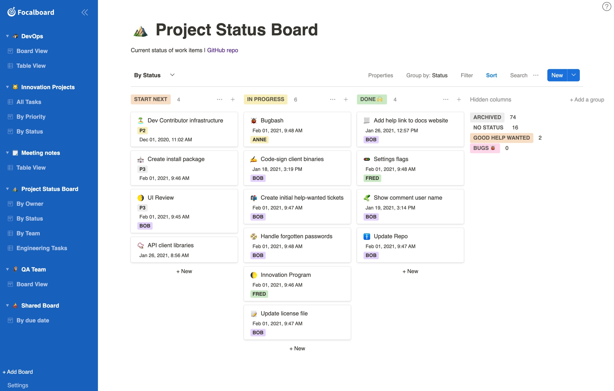

> [!WARNING]
> This repository is currently not maintained. If you're interested in becoming a maintainer please [let us know here](https://github.com/mattermost-community/focalboard/issues/5038).
>
> This repository only contains standalone Focalboard. If you're looking for the Mattermost plugin please see [mattermost/mattermost-plugin-boards](https://github.com/mattermost/mattermost-plugin-boards).
>

# Focalboard




Focalboard is an open source, multilingual, self-hosted project management tool that's an alternative to Trello, Notion, and Asana.

It helps define, organize, track and manage work across individuals and teams. This repository contains the **Personal Server** edition - a standalone, multi-user server for development and personal use.

## Getting Started

### Prerequisites

* [Git](https://git-scm.com/book/en/v2/Getting-Started-Installing-Git)
* [Go](https://golang.org/doc/install) (version specified in `server/go.mod`)
* [Node.js](https://nodejs.org/en/download/) (version specified in `webapp/.nvmrc`) and npm

### Quick Start

1. Clone this repository
2. Create an `.env` file in the project root:
   ```
   EXCLUDE_ENTERPRISE="1"
   ```

3. Build the server:
   ```bash
   make prebuild
   make
   ```

4. Run the server:
   ```bash
   ./bin/focalboard-server
   ```

5. Navigate to [`http://localhost:8000`](http://localhost:8000) in your browser

The default port is 8000, which can be configured in `config.json`.

### Development Workflow

Once the server is running, you can make changes to the web app and rebuild it:

```bash
make webapp
```

Then reload your browser to see the changes.

For continuous development, you can run the webapp in watch mode:

```bash
cd webapp && npm run watchdev
```

### Docker

Run Focalboard using Docker:

```bash
docker run -it -p 80:8000 mattermost/focalboard
```

Or build for your architecture:

```bash
docker build -f docker/Dockerfile .
```

For custom architectures:

```bash
docker build -f docker/Dockerfile --platform linux/arm64 .
```

## Testing

Before committing, run the full test suite:

```bash
make ci
```

This includes:
* **Server unit tests**: `make server-test`
* **Server tests with different databases**: `make server-test-mysql`, `make server-test-mariadb`, `make server-test-postgres`
* **Web app ESLint**: `cd webapp && npm run check`
* **Web app unit tests**: `cd webapp && npm run test`
* **Web app UI tests**: `cd webapp && npm run cypress:ci`

## API Documentation

The Boards API documentation is available at: <https://htmlpreview.github.io/?https://github.com/mattermost/focalboard/blob/main/server/swagger/docs/html/index.html>

## Resources

* **Documentation**: See [docs/dev-tips.md](docs/dev-tips.md) for detailed development tips
* **Changes**: See the [CHANGELOG](CHANGELOG.md) for the latest updates
* **Issues**: [Report bugs or request features](https://github.com/mattermost/focalboard/issues)
* **Chat**: Join the [Focalboard community channel](https://community.mattermost.com/core/channels/focalboard)

## License

See [LICENSE.txt](LICENSE.txt) for license information.
